# SRP — Система раннего предупреждения отказов Windows-станций
## Архитектурная спецификация данных (что клиент шлёт на сервер и почему)

> Документ — итог. Все рассуждения проведены внутренне. Здесь только выводы:
> причинная модель → перечень данных → формат → скрытые зависимости.
> Стиль критический: где исходная идея «собирать широко» вредна — сказано прямо.

---

## 0. Критический вердикт (без подыгрывания)

Исходный инстинкт — «собрать максимум телеметрии и потом разберёмся» — **неверен и
опасен**. Он даёт telemetry garbage, убивает сеть/БД, топит ML в шуме и создаёт поток
ложных алертов, который инженеры начнут игнорировать (alert fatigue → система мертва).

Три тезиса, на которых стоит вся архитектура:

1. **Предсказательная ценность сосредоточена в очень узком наборе сигналов.**
   95% полезного прогноза дают ~12 классов признаков. Остальное — косметика для дашборда.
2. **Абсолютные значения почти бесполезны. Информация — в производных:**
   наклон (slope), ускорение, отклонение от *собственного* baseline устройства,
   частота событий в окне, остаточная доля ресурса. CPU=80% не значит ничего;
   «температура при той же нагрузке растёт 3 недели подряд» значит почти всё.
3. **Машина уже содержит свою историю.** Event Log, Reliability Monitor, кумулятивные
   счётчики SMART, SRUM, battery report — это месяцы готовой телеметрии *на диске*.
   Поэтому осмысленную оценку можно дать в **день установки**, не собрав ещё ни одной
   собственной точки. Это ключ к UX «инженер поставил — сразу увидел диагноз».

Если коротко: **не «мониторинг», а ранний детектор накопления риска по узкому набору
причинных предвестников + индивидуальный baseline + fleet-приоры.**

---

## 1. Причинно-следственная модель отказа (сжато, по классам, с lead time)

Отказ почти никогда не «внезапен». Это накопление, имеющее предвестники с разным
горизонтом упреждения. Ранжировано по чистоте сигнала и длине lead time.

| Класс отказа | Главный предвестник (сигнал) | Lead time | Природа |
|---|---|---|---|
| **Накопитель (SSD/NVMe/HDD)** | рост media/integrity errors, падение available spare, рост pending/reallocated, рост latency-перцентилей при фикс. нагрузке, controller resets | **недели–месяцы** | монотонный, почти без шума — **самый ценный класс** |
| **Память (RAM)** | рост частоты correctable WHEA-ошибок | дни–недели | редкий, но чистый предвестник uncorrectable→BSOD |
| **Питание/стабильность** | кластеризация Kernel-Power 41, dirty shutdown 6008, bugcheck-кластеры | часы–дни | мета-сигнал «нестабильность растёт», не указывает причину |
| **Охлаждение** | рост temp@load, рост throttle-residency, рост RPM при той же temp | недели | **upstream-усилитель** прочих отказов |
| **Батарея (ноут)** | падение FCC/DesignCapacity, рост циклов, temp-residency | месяцы | предсказуемый износ + риск swelling |
| **CPU/GPU деградация** | corrected MCE (WHEA) slope, GPU TDR 4101 rate, throttle history | дни–недели | смешан с драйверной нестабильностью |
| **Драйверы/ПО** | crash/restart loops, рост bugcheck одного модуля, регрессия после update | часы–дни | частый источник «софт прикидывается железом» |
| **Шина/порты/док/USB/PCIe** | повторные re-enumeration, link retraining, NIC/USB resets | прерывистый | intermittent, виден только по частоте событий |
| **Файловая система / servicing** | disk timeouts, delayed writes, повторные сбои Windows Update | дни | часто следствие деградации накопителя |

**Главный принцип отбора: чем монотоннее и реже сигнал — тем он ценнее.**
Высокочастотные шумные метрики (мгновенный CPU%, throughput) — внизу ценности.

---

## 2. Скрытые / неочевидные зависимости (то, что просили — кратко)

Эти связи не видны при поверхностном «помониторим железо». Они меняют архитектуру.

1. **Thrash-and-cook спираль (кросс-слой, главная скрытая связь).**
   Нехватка RAM → рост commit/pagefile IO → **ускоренный износ SSD + рост latency** →
   зависания и риск BSOD. Софтовая причина маскируется под «умирающий диск».
   Поэтому износ накопителя нельзя оценивать без сигнала памяти/pagefile.

2. **Температура — это не отдельный класс, а усилитель.**
   Один тепловой сигнал предсказывает сразу несколько отказов: ускоряет износ SSD и
   батареи, усталость пайки/BGA, вызывает throttle→shutdown. Дешёвый сенсор с
   мультипликативным эффектом на приоры по другим классам.

3. **Тепловое ЦИКЛИРОВАНИЕ важнее пикового нагрева** для ноутбуков.
   Предиктор усталости пайки и intermittent-отказов — амплитуда ΔT × частота циклов,
   а не максимум. Драйверы циклирования — sleep/wake и док-циклы (их и надо считать).

4. **Прошлое машины — бесплатный датасет для day-1 оценки.**
   Reliability Monitor + Kernel-Power 41/6008 за N месяцев + кумулятивный SMART + SRUM
   позволяют «бэктестить» надёжность сразу при установке. Это даёт мгновенный диагноз
   до накопления собственных данных.

5. **Security-инструменты сами деградируют машину.**
   EDR/AV-сканы и sync-loops (OneDrive) дают реальный износ диска и падение
   производительности. Без контекстной нормализации это и ложные тревоги, и
   пропущенный реальный износ одновременно.

6. **Unexpected-shutdown — мета-приор, а не алерт.**
   Сам по себе не говорит «что», но обязан *одновременно поднимать приоры* по
   нескольким классам (питание, тепло, накопитель, RAM). Это байесовский множитель.

7. **Утилизация, отвязанная от присутствия пользователя = поведенческий сигнал.**
   Майнер/runaway/malware надёжнее ловится паттерном «нагрузка при отсутствии
   пользователя» (SRUM/foreground), чем сигнатурами.

8. **Correctable-ошибки — «температура перед болезнью».**
   Любые corrected-счётчики (WHEA corrected, NVMe available spare) с монотонным
   ростом получают высокий вес: у них чистый lead time, в отличие от шумных perf-метрик.

---

## 3. Что собирать — ранжированный список классов данных по predictive value

### TIER S — отправлять всегда, ядро прогноза
| # | Данные | Зачем (кратко) |
|---|---|---|
| 1 | **NVMe health log / SMART** (медиа-ошибки, available spare + threshold, percentage used/TBW, reallocated/pending/uncorrectable, critical-warning bits, темп. диска) | самый длинный и чистый lead time к катастрофе; монотонно; дёшево (медленный sampling) |
| 2 | **События нестабильности**: Kernel-Power 41, dirty shutdown 6008, BugCheck 1001, WHEA-Logger (1/17/18/19) | мета-сигнал нестабильности; редкие, высокоинформативные, event-driven, крошечный объём |
| 3 | **WHEA corrected errors slope** (CPU/RAM/PCIe) | чистейший аппаратный предвестник uncorrectable→BSOD |
| 4 | **Метаданные краша из minidump** (bugcheck-код, faulting module/driver, параметры — **не сам дамп**) | root cause + атрибуция класса отказа; десятки байт |

### TIER A — отправлять регулярно (агрегированно)
| # | Данные | Зачем |
|---|---|---|
| 5 | **Тепло, нормированное по нагрузке**: slope temp@load, throttle-residency, RPM@temp | upstream-усилитель; раннее обнаружение деградации охлаждения |
| 6 | **Износ батареи** (ноут): тренд FCC/Design, циклы, temp-residency | предсказуемый износ + риск swelling/безопасность |
| 7 | **Надёжность/ПО**: Reliability stability index trend, crash-rate приложений/служб, loops служб (SCM 7031/7034), тренд boot-time, доля сбоев resume | софтовая деградация и ранняя нестабильность |
| 8 | **Поведение I/O накопителя**: latency-перцентили при фикс. queue depth (тренд), disk reset/timeout (stornvme/storahci 129/153, disk 7/11/51/52) | деградация контроллера/линка; дополняет SMART |

### TIER B — контекст и fleet (редко / по изменению)
| # | Данные | Зачем |
|---|---|---|
| 9 | **Инвентарь + firmware**: модель, board, BIOS/firmware, SSD model+fw, RAM, дата выпуска/возраст | привязка к known-bad, приоры, cohort-baseline; шлётся 1 раз + при изменении |
| 10 | **Дельты драйверов + GPU TDR (4101)/reset-rate** | known-bad драйверы, регрессии после обновлений |
| 11 | **Дельты persistence/security**: новые autostart/служба/task/драйвер; score «нагрузка без присутствия»; флаги контекста скана | malware/майнер + контекстная нормализация износа |
| 12 | **Давление памяти/handle**: slope commit, rate pagefile IO, индикаторы leak, класс топ-растущего процесса | вход в thrash-спираль; софтовый root cause |
| 13 | **Только ОШИБКИ сетевых/шин**: NIC errors/resets, link flaps, USB/PCIe re-enumeration | intermittent деградация соединений; малый объём |

---

## 4. Что НЕ собирать (telemetry garbage — прямо и цинично)

| Не собирать | Почему |
|---|---|
| Сырые per-second perf-counters | нулевая предсказательная ценность, гигантский объём |
| Мгновенные снимки CPU%/RAM% | бессмысленны без baseline/контекста; дашборд-косметика |
| Суммарный network throughput | шум для прогноза отказов |
| Полные списки процессов каждый интервал | privacy-риск + низкая ценность; нужны только дельты/аномалии |
| Сырой firehose Event Log | вместо него — частоты по классам и whitelist конкретных Event ID |
| Полные minidump/crash-dump на сервер | объём + privacy; шлём извлечённые метаданные |
| Мгновенные частоты CPU/GPU | производное от throttle, отдельной ценности нет |
| Ненормированные кривые температуры | красиво, не предсказывает — нужен temp@load |
| Любой пользовательский контент / клавиатура / заголовки окон | privacy, нулевая польза для прогноза железа |

Пограничный случай: **свободное место на диске** — слать как редкий скаляр (operational
risk, не health); near-zero = реальный триггер, но к деградации железа отношения не имеет.

---

## 5. Клиент vs сервер (что и где считать)

**Клиент (дёшево, локально):**
- Sampling медленных счётчиков (SMART/NVMe/battery/inventory) на медленном такте.
- Подписка на Event Log (event-driven) по whitelist Event ID.
- Скользящие окна → признаки: EWMA, slope, percentiles, counts/окно, throttle-residency,
  дельты к **локальному baseline**.
- Контекст-теги: активны ли backup/scan/update/maintenance/ночь — для нормализации.
- Хранит локальный baseline → шлёт **отклонения, а не сырьё**.

**Сервер:**
- Хранит признаки (не сырьё), per-device + **cohort (по модели)** baseline, fleet/external knowledge.
- Байесовский/ML риск-скоринг **по классам отказа**, объяснимый (вклад каждого признака).
- Конвертация внешних знаний (known-bad fw/драйвер, CVE, vendor advisory) в **приор-множитель**.
- Оценка lead time по классам; мониторинг дрейфа модели; переобучение.

Принцип: **клиент агрегирует и нормирует, сервер сопоставляет и приоритизирует.**
Тяжёлые сырые данные не покидают клиент.

---

## 6. Event-driven vs sampling (такт)

| Режим | Такт | Что |
|---|---|---|
| Slow sample | 1–24 ч | SMART/NVMe, батарея, инвентарь, износ, обновление baseline |
| Medium sample (агрегат) | 1–5 мин, шлётся свёрнутым в heartbeat | temp@load, latency-перцентили, commit/pagefile, throttle-residency |
| **Event-driven (немедленно, dedup + rate-limit)** | по факту | Kernel-Power 41, WHEA, bugcheck, GPU TDR, loops служб, изменения persistence, disk resets |
| Heartbeat | 15–60 мин | компактный вектор признаков |
| Daily summary | 1×/сутки | сводка износа/трендов |

---

## 7. Формат отправки агента

- **Schema-versioned, компактный** (JSON или protobuf), маленький payload.
- Три типа сообщений:
  1. **Inventory** — редко / при изменении (фингерпринт устройства + компонентов + fw).
  2. **Heartbeat** — периодический вектор признаков (свёрнутые окна, дельты к baseline, контекст-теги).
  3. **Event** — немедленные редкие высокосигнальные события (с дедупликацией/rate-limit).
- Каждый признак сопровождается: значением, наклоном/дельтой, и **контекст-тегом** (что происходило).
- Устойчивость к офлайну: буферизация событий, монотонные счётчики (сервер берёт дельты), маркер «были пропуски».

---

## 8. Композитные сигналы и тренды (важнее абсолютов)

Самое ценное — **комбинации, где каждый признак по отдельности «в норме»:**

- **Thrash-and-cook**: ↑SSD latency + ↑commit + ↑pagefile IO + ↓thermal headroom → near-term hang/BSOD.
- **Тихий аппаратный распад**: WHEA-corrected trickle + недавние unexpected shutdown + known-bad BIOS → высокий приор BSOD.
- **Риск батареи**: высокий износ + высокий temp-residency + частые док-циклы → swelling/тепловое событие.
- **Деградация охлаждения**: rising temp@load + rising RPM@temp + rising throttle-residency.

Признаки трендов, которые надо вычислять: **slope, acceleration (вторая производная),
volatility, burstiness, event-count/окно, сдвиг формы распределения (не только среднего),
повторяемость серий**. Единичный выброс ≠ сигнал; устойчивая серия = сигнал.

---

## 9. Мгновенная оценка в день установки (UX для инженера)

На первом запуске собственного baseline ещё нет → оценка строится на **истории, уже
лежащей на машине** + fleet-приорах. Выдаём 4 скоринга + объяснение:

| Скоринг | Источник (всё читается сразу) |
|---|---|
| **Производительность** | тренд boot-time, текущая latency накопителя, давление RAM, thermal headroom |
| **Надёжность** | Reliability stability index, история Kernel-Power 41/6008/BSOD за N месяцев, crash-rate |
| **Остаточный ресурс (износ)** | SSD percentage used/spare, износ батареи, возраст vs MTBF |
| **Риск-экспозиция** | known-bad компоненты/BIOS/драйверы, security-постура, контекст (мобильность/док) |

Это и есть «инженер поставил — сразу понял многое о компе». Дальше скоринги уточняются
по мере накопления собственного baseline.

---

## 10. Снижение ложных срабатываний

- Нормировать по контексту: scheduled tasks, backups, updates, scans, ночь, maintenance window.
- Адаптивные пороги от **собственного baseline**, но с потолком, чтобы не «привыкать» к патологии.
- Игнорировать единичные выбросы; считать устойчивость и повторяемость серий.
- Разделять **инцидентные** (уже случилось) и **предиктивные** (накопление) сигналы.
- Мерить precision / recall / FPR честно; алерт без подтверждённого исхода — кандидат на отключение.

---

## 11. Ограничения

- **Права**: SMART/NVMe, ETW, ряд WMI-классов, чтение minidump — требуют админ/SYSTEM (агент как служба).
- **Версии Windows / разный набор счётчиков**: фиксировать доступность источников per-device; признак «источник недоступен» ≠ «всё хорошо».
- **Privacy/regulatory**: не собирать пользовательский контент, заголовки окон, URL; обезличивать; минимизировать процессные имена (хранить классы/хэши).
- **Безопасность канала**: TLS, аутентификация агента, подпись схемы.
- **Дрейф/пропуски/рассинхрон времени**: монотонные счётчики + серверные дельты; маркеры пропусков; регулярное переобучение и контроль качества.

---

## 12. Эволюция MVP → V3

| Этап | Содержание |
|---|---|
| **MVP** | TIER S + day-1 скоринги из истории машины. Уже полезный прогноз по накопителю и нестабильности. |
| **V1** | + Fleet/cohort baseline, конвертация known-bad → приоры, объяснимые risk-scores. |
| **V2** | + Локальный feature engineering (slopes/percentiles/burst), умная агрегация, работа с редкими событиями, контекст-нормализация. |
| **V3** | + Внешние БД (CVE/firmware/advisory), adaptive baselines, model-drift monitoring, root-cause clustering, прогноз по классам отказа с lead time. |

---

## 13. ФИНАЛЬНЫЙ ВЫВОД — что именно клиент шлёт на сервер (+ кратко почему)

**Inventory (1 раз + при изменении):** модель/board/BIOS+firmware/SSD model+fw/RAM/возраст.
*→ привязка к known-bad и cohort-baseline.*

**Event (немедленно, dedup):** Kernel-Power 41, dirty shutdown 6008, BugCheck 1001 +
bugcheck-метаданные (код, faulting driver), WHEA 1/17/18/19, GPU TDR 4101, service loops
SCM 7031/7034, disk reset/timeout, изменения persistence (autostart/служба/task/драйвер),
USB/PCIe/NIC re-enumeration.
*→ редкие высокосигнальные предвестники нестабильности и intermittent-отказов.*

**Heartbeat (15–60 мин, агрегат — только признаки/дельты, не сырьё):**
- SMART/NVMe health-дельты (media errors, available spare, percentage used, pending/reallocated, critical-warning, temp).
- Latency-перцентили накопителя при фикс. queue depth (тренд).
- temp@load slope + throttle-residency + RPM@temp.
- Износ батареи (FCC/Design тренд, циклы, temp-residency).
- Reliability stability index + crash/restart-rate + boot-time/resume тренды.
- Давление памяти (commit slope, pagefile IO rate, leak-индикаторы, класс топ-процесса).
- WHEA-corrected slope.
- Score «нагрузка без присутствия пользователя».
- Контекст-теги (scan/backup/update/ночь) к каждому признаку.

**Daily summary:** свёртка трендов износа и накопленных счётчиков.

**НЕ шлём:** сырые perf-counters, мгновенные CPU%/RAM%, throughput, полные списки
процессов, сырой Event Log, полные дампы, пользовательский контент.

**Самые ценные классы (по убыванию):** накопитель (SMART/NVMe) → события нестабильности →
WHEA-corrected → bugcheck-метаданные → тепло@нагрузка → износ батареи → надёжность/ПО →
I/O-поведение → инвентарь/firmware → драйверы/TDR → security/persistence → память →
ошибки шин/сети.

**Что реально ведёт к отказу:** износ накопителя (+ ускоренный софтом), тепловая
деградация как усилитель, тепловое циклирование (ноуты), correctable→uncorrectable (RAM/CPU),
питание/unexpected-shutdown, драйверные регрессии, износ батареи. **Прогноз строится на
трендах и комбинациях нормальных-по-отдельности признаков, а не на абсолютных порогах.**

---
---

# ЧАСТЬ 2. Конкретные задачи клиента для ОФИСНЫХ Windows-ПК

> Контекст уточнён: парк обычных офисных машин (десктопы + ноутбуки, скромное железо,
> корпоративные политики/EDR). Это **меняет модель рисков и ломает часть исходного
> доп-документа** — см. §C2.0. Ниже — точный перечень «что собирать / как / каким тактом»
> и расширенные скрытые зависимости.

## C2.0 Критический разбор твоего доп-документа (прямо, без подыгрывания)

| Твоё предложение | Проблема на офисном парке | Что делать вместо |
|---|---|---|
| Поля `voltages`, `fans_rpm`, темп. CPU как штатные | На офисных ПК **недоступны без kernel-драйвера** (LibreHardwareMonitor/vendor SDK), который корпоративный EDR/политики **блокируют**. `MSAcpi_ThermalZoneTemperature` часто пуст/одна зона/мусор | Тепло — **best-effort**. Прокси теплового здоровья = **throttle residency** (счётчики частоты) + событие Kernel-Processor-Power 37. Предсказываешь перегрев **без термометра** |
| Сбор CPU каждые 5–15 с (и отправка) | Расточительно, низкая predictive value, нагрузка на агент/сеть | Семплировать умеренно, **feature engineering на клиенте**, слать свёртку (p50/p95/slope) |
| Security-журнал (4625 failed logon, 4719) в failure-prediction | Это сигнал **ИБ, не предвестник деградации**; шум + privacy-риск | Оставить SIEM; в SRP не тащить |
| Плоский JSON одной строкой со всеми метриками | Не масштабируется: у полей разный такт и TTL | Разделить на **inventory / heartbeat / event** (§7) |
| `Processor Queue Length` как ключевая | Устаревающая, шумная | Вторична; **latency-перцентили + throttle residency** информативнее |
| ML прямо на сырых значениях | Сырьё на сервере = garbage + дорого | Признаки строить на клиенте; сервер сопоставляет |

**Главное смещение для офиса:** доминирующая причина «тормозит/глючит» — **не железо, а
корпоративный софтовый налог** (EDR realtime-скан + OneDrive sync + Teams + backup + VPN)
и **переполнение диска**. Систему надо строить так, чтобы это **моделировать как baseline**,
иначе каждый здоровый ПК выглядит «деградирующим».

## C2.1 Группы задач сбора (что / как / такт)

Источники указаны точно. CIM (`Get-CimInstance`), а не устаревший `Get-WmiObject`.
События — через **push-подписку** (EvtSubscribe), не polling. Perf — PDH/`Get-Counter`.

### Группа 0 — Day-1 исторический скан (1 раз при установке: читаем ПРОШЛОЕ машины)
| # | Что | Источник / метод | Считать локально | Слать |
|---|---|---|---|---|
| 0.1 | История надёжности ~год | `Win32_ReliabilityStabilityMetrics` + `Win32_ReliabilityRecords` | тренд stability index, счёт отказов | индекс+тренд, топ-классы сбоев |
| 0.2 | История нестабильности 90–180 дн | `Get-WinEvent`: Kernel-Power 41, EventLog 6008, BugCheck 1001 (+код) | частоты/неделя, кластеры | счётчики + bugcheck-коды |
| 0.3 | Текущий износ накопителя | `Get-PhysicalDisk \| Get-StorageReliabilityCounter` (Wear, PowerOnHours, Read/WriteErrors), `MediaType` | — | wear%, наработка, error totals, HDD/SSD |
| 0.4 | Износ батареи (ноут) | `powercfg /batteryreport /xml` | FCC/Design | wear%, циклы |
| 0.5 | Тренд boot-time 30–60 дн | `Microsoft-Windows-Diagnostics-Performance/Operational` ID 100 | slope, медленные загрузки | тренд + кол-во slow-boot |
| 0.6 | Возраст/инвентарь | `Win32_BIOS.ReleaseDate`, disk firmware, model | возраст | фингерпринт |

→ **результат: 4 скоринга сразу** (производительность / надёжность / остаточный ресурс / риск-экспозиция).

### Группа 1 — Inventory (1 раз + при изменении)
`Win32_ComputerSystem` (Model/Manufacturer), `Win32_BIOS` (версия+дата), `Win32_Processor`,
`Win32_PhysicalMemory`, `Win32_DiskDrive` (Model/FirmwareRevision/**Serial→hash**), `MediaType`,
OS build, драйверы `Win32_PnPSignedDriver`, **проблемные устройства** `Win32_PnPEntity`
где `ConfigManagerErrorCode<>0`, **pending-reboot** (реестр CBS/WU/PendingFileRenameOperations).
→ слать фингерпринт + список проблемных устройств + версии драйверов + флаг pending-reboot.

### Группа 2 — Slow health (1×/сутки)
- StorageReliabilityCounter **дельта** (wear, error totals, PowerOnHours) + `HealthStatus`.
- Свободное место `Win32_LogicalDisk` + **slope → прогноз даты заполнения**; `fsutil dirty query`.
- Батарея: дельта wear + циклы; `powercfg /sleepstudy` (sleep/wake).
- Health ОС: WU-сбои (`Microsoft-Windows-WindowsUpdateClient` 20/25/31), pending-reboot, Defender (`Get-MpComputeStatus`, возраст сигнатур).
- Обновление reliability index.

### Группа 3 — Heartbeat samplers (семпл ~30–60 с; СВЕРНУТЬ и слать раз в 15–60 мин)
| Что | Счётчики (PDH) | Слать (агрегат) |
|---|---|---|
| CPU + throttle | `\Processor Information(_Total)\% Processor Time`, `% Processor Performance`, `% of Maximum Frequency`, `\System\Processor Queue Length` | p50/p95, отклонение от baseline, **throttle-residency**, **load-vs-presence** |
| Память | `\Memory\Available MBytes`, `Committed Bytes`, `% Committed Bytes In Use`, `Pages Input/sec` (hard faults), `\Paging File(_Total)\% Usage` | **slope commit**, p95 hard-fault, pagefile% |
| Диск I/O | `\PhysicalDisk(*)\Avg. Disk sec/Read`, `…sec/Write`, `Current Disk Queue Length` | **p95 latency + slope** на физ. диск |
| Тепло (best-effort) | `MSAcpi_ThermalZoneTemperature` если есть; иначе прокси = throttle | temp@load **если доступно**, иначе флаг «нет» + throttle-residency |
| Сеть (только ошибки) | `\Network Interface(*)\Packets Outbound/Received Errors`, `Output Queue Length` | error-rate (НЕ throughput) |
| Утечки (по подозрению) | `\Process(*)\Handle Count`, `Private Bytes` | класс топ-растущего процесса |

**Присутствие пользователя:** `GetLastInputInfo` / `WTSQuerySessionInformation` → тег к каждому
семплу (нужно для load-vs-presence и нормализации пиков).

### Группа 4 — Event subscriptions (немедленно, dedup + rate-limit)
Whitelist: Kernel-Power **41**, EventLog **6008**, BugCheck **1001**(+код+модуль), WHEA-Logger
**17/18/19/1**, disk **7/11/51/52/153**, stornvme/storahci **129**, Ntfs **55/137**, SCM **7031/7034**,
Application Error **1000**, Display(TDR) **4101**, Kernel-Processor-Power **37/86**, NIC link-down,
USB/PCIe re-enumeration, **persistence-дельта** (новые auto-служба/task/driver/Run-key),
Defender **1116/2001**.
→ агент считает частоты в окне + шлёт отдельные значимые единичные события.

## C2.2 Как строить агент (ограничения офиса)
- **Windows Service под LocalSystem** — иначе нет доступа к SMART/ETW/части WMI.
- Бюджет ресурсов: средн. **<1–2% CPU**, троттлить собственный сбор, **не семплировать в пик пользователя**.
- Офлайн: буфер событий, **монотонные счётчики** (дельты считает сервер), маркер пропусков.
- Конфигурируемые интервалы через **GPO/политику** (корп-требование).
- Деградация по доступности: если источник недоступен (нет драйвера темпы) — флаг, а не «всё ок».

## C2.3 Расширенные СКРЫТЫЕ зависимости (office-specific, нестандартное)

1. **Диск-фул → сбой Windows Update → дрейф безопасности → каскад нестабильности.**
   Teams/OneDrive/temp/Windows.old забивают C:. Мало места → WU падает → повреждение
   servicing store → новые сбои. **Свободное место — не «операционка», а причинно
   upstream** для софтовой нестабильности. Slope free-space = ранний индикатор WU-сбоев.

2. **Корпоративный софтовый налог + observer effect.** EDR-скан + sync + Teams + backup —
   главный источник «медленно» на офисном парке, и **сам агент SRP добавляет в этот налог**.
   Без моделирования стека как baseline каждый ПК ложно «деградирует».

3. **Тепловое здоровье без термометра.** Раз сенсоры темпы/вольтаж/RPM на офисе обычно
   заблокированы, перегрев/деградацию СО детектируем по **throttle residency** («CPU всё
   больше времени ниже max-частоты при той же нагрузке») + событие 37. Почти никто так не делает.

4. **Fleet-as-sensor для фактов площадки.** Кластер Kernel-Power 41 у многих ПК одной
   локации/подсети в одном окне = **проблема электрики/AC здания**, а не отказ конкретного ПК.
   Корреляция unexpected-shutdown по локации/времени **снимает массовые ложные «железные» тревоги**.

5. **Boot-time — интегральный «витал».** Тренд медленной загрузки агрегирует разом: latency
   диска, bloat драйверов, разрастание служб, persistence malware, износ. Одно дешёвое
   число (Diagnostics-Performance 100) с высокой интегральной ценностью.

6. **HDD vs SSD = разные модели риска.** Парк смешанный: HDD дохнут механически
   (reallocated/pending, spin-up, seek), SSD — износ/контроллер. Логику **ветвить по
   MediaType**; одинаковый подход = мусор. HDD-машины обычно старше → возраст×тип усиливают.

7. **Swelling батареи коррелирует с позой эксплуатации, не возрастом.** Вечно-в-доке/100%/тёплый
   ноут пухнет быстрее циклируемого. **«Мало использовался» ≠ «низкий риск»**:
   высокий charge-residency + тепло + малые циклы = риск вздутия.

8. **Pending-reboot — скрытый множитель нестабильности.** ПК неделями с отложенным
   ребутом обновления: драйверы полуобновлены, патчи не применены, память фрагментирована →
   «странное поведение». Дешёвый флаг (реестр CBS), сильная корреляция.

9. **Дрейф часов = и порча данных, и сигнал железа.** Сбой RTC/CMOS-батареи или w32time →
   ненадёжные timestamp → **ломается сам трендовый анализ**. И одновременно сдыхающая
   CMOS-батарея = старение платы. Двойной смысл — мониторить `w32tm /query /status`.

10. **Док/USB-C — скрытый источник «отказов ноута».** Дешёвый/старый док даёт TDR (4101),
    шторм USB re-enumeration, срывы заряда. Корреляция TDR+USB-reset+flapping заряда →
    **виноват док, меняем док, а не здоровый ноут**. Экономит замену исправных машин.

11. **RAM-«ошибки» на офисе редко про RAM.** WHEA memory-error на десктопе часто = тепло/PSU,
    не DIMM. Сигнал памяти **не должен авто-обвинять планку** — поднимает мульти-класс приор.

12. **Паттерн «пятница/понедельник».** Dirty-shutdown кластеризуются, когда юзеры рвут
    питание уходя в пятницу; порча всплывает в понедельник на boot. Недельная сезонность
    событий отделяет **поведение пользователя** от отказа железа.

## C2.4 Итог Части 2 — минимальный список того, что реально шлёт офисный клиент
- **Day-1:** reliability-история, счётчики Kernel-Power 41/6008/BugCheck за 90–180 дн, текущий
  wear диска, износ батареи, тренд boot-time, инвентарь+возраст. *(прошлое уже на машине)*
- **Inventory:** фингерпринт + MediaType + драйверы + проблемные устройства + pending-reboot.
- **Heartbeat (свёртка):** CPU p95+throttle-residency+load-vs-presence; commit-slope+hard-faults;
  disk p95-latency+slope; temp@load **если доступно**; сетевые ошибки; класс утекающего процесса;
  свободное место + slope. *(всё с контекст-тегами scan/backup/update/присутствие)*
- **Event:** Kernel-Power 41, 6008, BugCheck(+код), WHEA 17/18/19, disk 7/11/51/52/153, TDR 4101,
  Kernel-Processor-Power 37, SCM 7031/7034, persistence-дельты, USB/NIC resets.
- **НЕ слать:** вольтаж/RPM/темп как обязательные (на офисе нет), сырые CPU per-15s, throughput,
  security-журнал логонов, полные дампы/списки процессов, любой пользовательский контент.

---
---

# ЧАСТЬ 3. Стратегическая архитектура системы (принципиально)

## C3.0 Что это такое и чем НЕ является

**Одной фразой:** SRP — это **детектор накопления риска и прогноз времени до отказа по
классам**, а не монитор состояния. Он отвечает на вопрос «**что, с какой вероятностью и
через сколько сломается, и почему**», а не «какая сейчас загрузка CPU».

**Чем НЕ является (YAGNI-границы, чтобы не расползлось):**
- НЕ real-time SIEM / не ИБ-система (события безопасности — соседняя система).
- НЕ general observability/APM платформа с красивыми графиками.
- НЕ сборщик сырой телеметрии «на всякий случай».
- НЕ black-box оракул на deep learning.

## C3.1 Девять стратегических принципов (фундамент)

1. **Прогнозируем накопление риска, а не пороги состояния.** Каждая подсистема имеет
   «бюджет здоровья», он расходуется; следим за **скоростью расхода и прогнозом исчерпания**.
2. **Тренды и отклонение от СОБСТВЕННОГО baseline, а не абсолюты.**
3. **Объяснимость по построению** (Bayesian + survival), а не пост-хок интерпретация чёрного ящика.
4. **Cold-start из прошлого самой машины + fleet-приоров** → польза в день 1.
5. **Тонкий стабильный агент / толстый эволюционирующий сервер** — диктуется экономикой
   развёртывания (см. C3.4).
6. **Замкнутая петля меток (label loop) — иначе это дашборд** (см. C3.7). Без неё система
   не учится и её точность невозможно измерить.
7. **Парк как сенсор** — кросс-девайсная корреляция снимает массовые ложные тревоги.
8. **Контекст-нормализация — гражданин первого класса** (корпоративный софтовый налог).
9. **Дисциплина стоимости** — собирать только высокоценные сигналы, деградировать мягко,
   калиброванные вероятности важнее «точности».

## C3.2 Центральная модель: бюджет риска + таксономия классов

Система не считает «здоровье ПК» одним числом. Она ведёт **margin-depletion** по
независимым **классам отказа** — у каждого свой сигнал, lead-time, модель и стоимость ошибки:

| Класс отказа | Горизонт | Стоимость FN (пропуск) |
|---|---|---|
| Накопитель (SSD wear / HDD механика) | недели–месяцы | **высокая** (потеря данных) |
| Питание / стабильность (shutdown/BSOD) | часы–дни | высокая (простой) |
| Память (correctable→uncorrectable) | дни–недели | средняя |
| Охлаждение / тепловая деградация | недели | средняя (усилитель) |
| Батарея (износ / **swelling**) | месяцы | **высокая (безопасность)** |
| GPU / драйвер (TDR, регрессии) | часы–дни | средняя |
| Софтовая гниль ОС (boot-rot, WU, servicing) | дни–недели | низкая–средняя |
| Периферия / док / шина | прерывисто | низкая (но путает диагноз) |

Композитные 4 скоринга для инженера (перф/надёжность/ресурс/риск-экспозиция) —
это **агрегаты над классами**, а не самостоятельные сущности.

## C3.3 Декомпозиция системы (компоненты и границы)

```mermaid
flowchart LR
  subgraph AGENT[Агент — тонкий, стабильный, версионированный контракт]
    C[Коллекторы\nstorage/perf/events/inv/battery] --> FE[Feature Engine\nокна, slopes, p95, throttle]
    FE --> BL[(Локальный baseline)]
    FE --> CT[Контекст-теггер\nприсутствие/scan/backup]
    CT --> BUF[Буфер + транспорт\noffline-safe, TLS, schema-ver]
    SG[Self-governor\nбюджет ресурсов] -.-> C
  end
  BUF --> GW

  subgraph SERVER[Сервер — толстый, эволюционирует без редеплоя агента]
    GW[Ingest gateway\nauth/schema/dedup] --> TS[(TSDB + event store: фичи)]
    GW --> REL[(Relational: inventory, labels)]
    TS --> BLS[Baseline service\nper-device + cohort-by-model]
    KB[(База знаний\nвнутр. паттерны + внеш. known-bad)] --> RE
    BLS --> RE[Risk Engine\nsurvival + Bayesian + anomaly + fleet-correlator]
    RE --> PR[(Предсказания + объяснения)]
    PR --> API[API / UI]
    API --> ENG[Инженер: подтвердил/отклонил]
    ENG --> LBL[Label service / ITSM] --> ML
    ML[Model lifecycle\nshadow/champion-challenger/drift/calib] --> RE
    ML -. mines .-> KB
  end
```

Каждый компонент: **одна ответственность, явный интерфейс, тестируется отдельно.**
Коллекторы изолированы и деградируемы (нет драйвера темпы → флаг, не падение агента).

## C3.4 Граница агент/сервер — экономика развёртывания (ключевое стратегическое решение)

**Асимметрия:** в корпоративной среде **редеплой агента на тысячи заблокированных машин —
дорого, медленно, требует согласований ИБ**. Итерация серверной модели — дёшево и часто.

**Следствие (жёсткое правило):** в агент кладём только то, что **меняется редко** —
коллекторы, оконный feature-engineering, локальный baseline, контекст-теги.
**Вся логика, которая будет меняться** (веса риска, модели, пороги, классификация
паттернов) — на сервере. Между ними — **стабильный версионированный контракт фич**.
Никогда не зашивать в агент то, что захочется потом подкрутить.

## C3.5 Аналитическое ядро — 4 слоя (почему именно так)

Это **гибрид**, потому что задача = редкие события + цензурированные данные + требование
объяснимости + cold-start + мало данных на устройство. Под это deep-learning-классификатор
не подходит (переобучится/наголодается). Правильные инструменты:

1. **Survival / time-to-event модели на класс** (hazard, напр. Cox / GBM-survival).
   Дают S(t) → **P(отказ к горизонту 7/30/90 дн) и остаточный ресурс**. **Цензурирование
   нативно** (живые устройства = не-failed). Базовый hazard стратифицирован по когорте.
   *Это и есть корректная формулировка «когда сломается», а не классификация да/нет.*
2. **Байесовская агрегация риска** → объединяет **приор** (возраст vs MTBF, known-bad
   firmware/driver, частота отказов когорты) с **likelihood** текущих улик (anomaly-скоры,
   event-rate, slope). Выдаёт **posterior-риск по классу + вклад каждого фактора в log-odds
   = готовое объяснение**. Работает в день 1 на одних приорах. *(консистентно с байес-ядром.)*
3. **Unsupervised anomaly detection на устройство** → отклонение от **своего** нормального
   (робастная статистика / EWMA-контрольные карты / Mahalanobis|isolation-forest по вектору
   фич). Персонализирует likelihood: «этот ПК ведёт себя не как обычно».
4. **Fleet-слой** → когортные baseline (по model+fw), **кросс-девайсная временная корреляция**
   (события площадки), **майнинг precursor-комбо** перед подтверждёнными отказами → питает KB и приоры.

**Выходы ядра на каждое предсказание:** вероятность по горизонтам + **confidence**
(= достаточность данных устройства × калибровка модели на когорте × сила/устойчивость сигнала)
+ **explanation** (топ-факторы) + **lead-time** + рекомендованное действие.

## C3.6 База знаний (превращение знаний в риск-факторы)

- **Внутренняя (учится):** намайненные precursor-паттерны, когортные нормы, реальные
  частоты отказов по model+firmware из собственного парка.
- **Внешняя (курируется заранее, НЕ скрапится агентом):** known-bad SSD/BIOS/driver версии,
  vendor advisories, CVE с perf-импактом, публичная статистика надёжности (напр. drive-stats),
  MTBF. Маппится на **фингерпринт устройства → приор-множитель** в байес-слое.
- Внешние знания **никогда не тащит клиент** — клиент шлёт только идентификаторы; обогащение на сервере.

## C3.7 Петля меток (label loop) — иначе это просто дашборд

Самая частая причина смерти предиктивных систем: **нет ground-truth → нельзя обучать и
нельзя измерить precision/recall → доверие рушится.** Поэтому петля закладывается с 1-го дня:

- **Жёсткие метки:** замена/RMA из ITSM, диск ушёл в read-only/выпал, BSOD-факт, событие
  вздутия/перегрева батареи.
- **Слабые/прокси-метки:** SMART failure-predict, кластер Kernel-Power 41, рост uncorrectable.
- **Обратная связь инженера в UI:** на каждом предсказании «подтвердил / отклонил / не дожил».
- **Интеграция с тикет-системой** замыкает контур: предсказание → действие → исход → метка → переобучение.

Без этого precision/recall (которые ты сам просил считать честно) — невычислимы.

## C3.8 Жизненный цикл модели (не доверять модели вслепую)

- **Shadow mode:** новая модель предсказывает параллельно, в прод не алертит, сверяется с исходами.
- **Champion/challenger:** промоушн только если challenger бьёт champion по
  **lead-time-adjusted precision**, а не по сырой accuracy.
- **Калибровка обязательна:** reliability diagram + Brier score; isotonic/Platt-рекалибровка.
  *Некалиброванная вероятность бесполезна для триажа — инженер не сможет приоритизировать.*
- **Drift monitor:** дрейф распределения фич (заменили железо, новый билд ОС, новый EDR) →
  триггер переобучения. Регулярный ретрейн на свежих метках.

## C3.9 Контроль ложных срабатываний — как свойство архитектуры

Не «настройка порога», а несколько слоёв сразу:
1. Дебаунс: требовать **устойчивую серию**, не единичный выброс.
2. Контекст-нормализация (scan/backup/update/присутствие).
3. Кросс-девайс: события площадки не считать отказом ПК.
4. **Confidence-gating:** ниже порога уверенности — не алертить.
5. **Асимметрия стоимости по классу:** рабочую точку выбирать из cost(FN)/cost(FP).
   Батарея-swelling/SSD-imminent → **смещать в recall** (безопасность/данные).
   Slow-boot/мелочь → **смещать в precision** (не шуметь).
6. Авто-супрессия правил с плохим измеренным FPR + ретюн по фидбэку.

## C3.10 Продукт для инженера (что реально видит)

- **На установке:** 4 скоринга мгновенно (из прошлого машины) + «топ-3 риска».
- **На устройство:** композитное здоровье + список **предсказанных проблем** =
  `класс • вероятность@горизонт • confidence • lead-time • объяснение (топ-факторы) •
  рекомендованное действие • known-bad флаг`.
  Пример: «SSD: отказ ~3–6 нед, conf 80% — рост pending-секторов + latency p95; firmware в
  advisory X. → бэкап + замена».
- **На парк:** приоритизированный список «кого трогать первым», когортные выбросы,
  сигналы уровня площадки, прогноз дат (заполнение диска, исчерпание ресурса).
- **Различать:** предиктивное («вероятно сломается, lead-time N») vs инцидентное («уже сломалось»).

## C3.11 Масштаб / приватность / безопасность (как ограничения дизайна)

- **Масштаб:** агент шлёт фичи (не сырьё) → объём растёт линейно и контролируемо; TSDB для
  фич + relational для инвентаря/меток; модели на когортах, не на каждом ПК отдельно.
- **Приватность:** обезличенный `client_id` (хеш), без пользовательского контента/URL/логонов;
  имена процессов → классы/хеши; соответствие политике/GDPR (не хранить лишнее).
- **Безопасность:** агент-служба с аутентификацией, TLS, подпись схемы, least-privilege;
  деградация при заблокированных источниках, а не обход политик.

## C3.12 Эволюция (зрелость движка, заземлённая в этой архитектуре)

| Этап | Что работает | Движок |
|---|---|---|
| **MVP** | TIER S + day-1 скоринги; алерты по накопителю и нестабильности | приоры + простые survival; **прокси-метки**; калибровка вручную |
| **V1** | fleet/cohort baseline; объяснимые риски; known-bad→приоры | байес-агрегация + survival на класс; **ITSM label loop включён** |
| **V2** | локальный feature-engineering, anomaly-слой, редкие события, контекст-норм | per-device anomaly + champion/challenger + калибровка |
| **V3** | внешние БД, adaptive baselines, drift-monitor, root-cause clustering, прогноз по классам с lead-time | полный гибрид + майнинг precursor-паттернов в KB |

## C3.13 Главные стратегические риски проекта (честно — где провалится)

1. **Дефицит меток** → не обучить/не измерить. *Митигация:* прокси-метки + ITSM с 1-го дня +
   публичная reliability-статистика как стартовый приор, пока свои метки не накопятся.
2. **Тепловая слепота офисного парка** → часть тепловых отказов непрогнозируема. *Принять и
   очертить scope:* throttle-прокси покрывает деградацию СО, но не всё.
3. **Cold-start парка без своей истории отказов** → опираться на внешние знания и survival-приоры.
4. **Alert fatigue** → confidence-gating + cost-настроенные рабочие точки + супрессия шумных правил.
5. **Трение развёртывания агента** → тонкий стабильный агент, эволюция на сервере.
6. **Блокировка источников ИБ/политиками** → мягкая деградация + декларация доступности.
7. **Сверхдоверие к ML** → shadow + champion/challenger + калибровочные гейты, без слепого прода.

**Вывод Части 3:** ядро ценности — не сбор данных, а **(survival + Bayesian) движок с
замкнутой петлёй меток, индивидуальным baseline и fleet-приорами**, выдающий **калиброванные,
объяснимые, с lead-time** прогнозы по классам отказа. Агент тонкий и стабильный; сервер —
эволюционирует. Всё остальное (графики, метрики) — обвязка вокруг этого.
