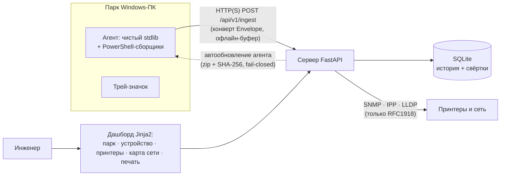

# SRP — раннее предупреждение отказов парка Windows-ПК

**SRP** — self-hosted система мониторинга офисных компьютеров под Windows, которая
замечает деградацию машин **до** отказа. Тонкий агент без единой сторонней зависимости
собирает телеметрию (SMART, журналы событий, BSOD, производительность, сеть, печать),
сервер на FastAPI + SQLite накапливает историю и считает объяснимые оценки здоровья,
а живой веб-дашборд показывает весь парк: компьютеры, принтеры, карту сети и учёт печати.

Главный тезис проекта: **абсолютные значения — слабый сигнал; информация живёт в
производных** — трендах, базовых линиях, накопленной истории. Агент только сообщает,
что наблюдал; всю аналитику делает сервер.

**Кому это нужно:** системному администратору или инженеру, который отвечает за
десятки–сотни обычных офисных ПК в локальной сети и хочет узнавать о умирающем диске,
деградирующей памяти или зависшем принтере раньше пользователей — без облака,
подписок и тяжёлых enterprise-стеков.

## Проект одним взглядом

| Факт | Значение |
|---|---|
| Назначение | Раннее предупреждение отказов и деградации Windows-ПК, мониторинг принтеров и карта локальной сети |
| Агент | Windows, Python 3.9+, **только стандартная библиотека** — ноль pip-пакетов на рабочих машинах; собирается в один `srp-agent.exe` |
| Сервер | FastAPI + uvicorn + pydantic v2 + Jinja2; хранилище — один файл SQLite, внешних сервисов нет |
| Сбор данных | PowerShell 5.1+ (языконезависимо: CIM-классы и числовые коды, не локализованные строки) |
| Дашборд | Серверный рендер (Jinja2), без JS-сборки и node_modules |
| Приватность | Серийники дисков хешируются на машине; наружу уходят только адреса RFC1918; приватные ключи не покидают ПК никогда |
| Развёртывание | `setup.exe --server … --org … --dept …` одной командой с сетевой шары; SYSTEM-задача Планировщика |
| Версия | 0.2.0 · активная разработка · [CHANGELOG.md](CHANGELOG.md) |

## Содержание

[Возможности](#возможности) · [Как это работает](#как-это-работает) ·
[Быстрый старт](#быстрый-старт) · [Боевое развёртывание](#боевое-развёртывание-агента) ·
[Дашборд](#страницы-дашборда) · [Конфигурация](#конфигурация) ·
[Автообновление](#автообновление-агентов) · [Безопасность](#безопасность-и-приватность) ·
[Ограничения](#известные-ограничения) · [Разработка](#разработка-и-качество-кода) ·
[FAQ](#faq) · [Структура репозитория](#структура-репозитория)

---

## Возможности

### Здоровье компьютеров

- **Три координаты здоровья** вместо одного «магического» числа: *Повреждения*
  (что уже сломано или изношено), *Устойчивость* (как машина переносит нагрузку и сбои),
  *Наблюдаемость* (насколько полно мы её видим). Каждая — со шкалой, подписью
  и статичным объяснением «почему».
- **Байесовский риск по классам отказа** — накопитель, батарея, питание/перегрев,
  память, стабильность. Расчёт в лог-оддсах: `posterior = sigmoid(prior + Σ весов признаков)`,
  каждый член подписан — дашборд показывает, какие именно признаки подняли риск.
- **Вердикт словами**: карточка устройства ведёт инженера текстом —
  состояние · главный фактор · что делать, — а не заставляет расшифровывать цифры.
- **Прогноз-траектории**: тренды заполнения диска, деградации ОС, старения ПО,
  ресурса батареи; движок хранилища с правилами по pending-секторам и рецидивам
  дефектов, которые **самоподтверждаются на истории вашего же парка**
  (вклад правила усиливается до ×1.5 или приглушается до ×0.8 по фактическим исходам).

### Доверие к данным

Слой доверия (`server/trust/`) отслеживает каждый источник телеметрии: заблокирован ли
сборщик, свежи ли данные, проходят ли они семантическую проверку. Принцип —
**честное UNKNOWN лучше ложной уверенности**: если SMART недоступен, машина не выглядит
здоровой «по умолчанию», а дашборд прямо показывает пробел в наблюдаемости.

### Принтеры

Автообнаружение и опрос сетевых принтеров по SNMP (с fallback на IPP/HTTP для
не-SNMP моделей): расходники, счётчики страниц, статусы, ошибки, задания IPP.
Аппаратные принтеры автоматически сопоставляются с очередями печати на компьютерах.

### Карта сети

Единая страница `/netmap`: агенты выступают L2-«наблюдателями» своей подсети (ARP),
сервер добавляет SNMP-инвентарь, LLDP-топологию, беспроводные связи и пассивную
деанонимизацию узлов. Опциональные read-only адаптеры: MikroTik, UniFi, Redfish, NetFlow.
Один узел сети = одна каноническая карточка, будь то компьютер с агентом, принтер
или неизвестное устройство.

### Учёт печати

Кто → на каком принтере → сколько страниц: серии по дням, журнал записей,
фильтры по организациям/отделам, выгрузка в CSV.

### Эксплуатация

- Установка агента **одной командой** с сетевой шары; страница `/deploy` сама
  генерирует готовую команду под выбранный отдел.
- **Автообновление агентов** с сервера (fail-closed: пакет с несовпавшим SHA-256
  парку не предлагается).
- Офлайн-буфер: сервер недоступен — конверты копятся в JSONL и досылаются FIFO.
- Наблюдаемость самого сервера: страница `/pipeline` и `/api/v1/metrics`
  (ожидание write-лока БД, отказы ingest, очередь пересчёта).
- Трей-значок на рабочих местах: статус агента и напоминания об истекающих сертификатах.

---

## Как это работает

**Тонкий агент / толстый сервер.** Агент не принимает решений — он собирает четыре
типа сообщений и шлёт их в общем конверте (`Envelope`, контракт — `shared/schema.py`):

| Тип | Что это | Как часто (по умолчанию) |
|---|---|---|
| `inventory` | Медленная «личность» машины: железо, ОС, диски, сертификаты | раз в сутки |
| `historical` | Скан «день-1»: прошлое машины как датасет (журналы, BSOD, SMART-история) | раз в сутки |
| `heartbeat` | Живые показатели: CPU, память, диск, задержки, сеть, печать | раз в 5 минут |
| `events` | Белый список событий журнала Windows (по числовым ID и уровням) | раз в 15 минут |



На каждое сообщение сервер: валидирует его pydantic-моделью на границе → записывает
в SQLite → ставит устройство в коалесцирующую очередь пересчёта (шторм конвертов
одной машины = один пересчёт) → обновляет координаты здоровья, риски и прогнозы.

**Хранение историй.** Сырые heartbeats живут 30 дней, события — 90; дальше данные
сворачиваются в дневные агрегаты с ретенцией 2 года, а сырые окна перед удалением
сжимаются в архив — «нашли новый предвестник отказа» не означает «а сырья уже нет».

---

## Быстрый старт

Понадобится Python 3.9+ (агенту — на Windows; серверу — на любой машине).

### Сервер

```powershell
python -m venv .venv
.\.venv\Scripts\Activate.ps1
pip install -r requirements.txt      # FastAPI, uvicorn, pydantic v2, Jinja2
python -m server.main
```

Дашборд: `http://<IP-сервера>:8000/` · REST: `/api/v1/` · настройки: `server/config.json`.

### Агент (проверка на одной машине)

```powershell
# один проход всех сборщиков и выход — для проверки и диагностики
python -m client.agent --server http://192.168.1.10:8000 --once

# постоянная работа по интервалам из client/config.json
python -m client.agent
```

**Адрес сервера обязателен — дефолта нет.** Если `server_url` пуст, агент не
запускается (и подсказывает, что настроить), а не шлёт телеметрию в неизвестный хост.
`device_id` оставьте пустым: при первом запуске агент возьмёт стабильный `MachineGuid`
из реестра и запишет его обратно в конфиг.

Быстрая проверка всей цепочки без сети и PowerShell: `python smoke.py`.

---

## Боевое развёртывание агента

В бою агент работает **под LocalSystem (SYSTEM)** через Планировщик заданий: без прав
SYSTEM часть сборщиков (SMART, ряд WMI-классов) возвращает пусто, и слой доверия честно
помечает их UNKNOWN. Запуск под SYSTEM их разблокирует.

Массовый раскат — самодостаточные exe (PyInstaller, только для сборки; сам код агента
остаётся чистым stdlib) и установщик одной командой:

```bat
build.bat                      REM собрать dist\share\ (agent + tray + setup)
\\server\srp$\setup.exe --server http://192.168.1.10:8000 --org 101 --dept 7
```

`setup.exe` (манифест UAC-admin): копирует в `C:\SRP`, **закрывает ACL** (запись только
SYSTEM/администраторам — это и есть настоящая защита конфига), мержит `config.json`
с сохранением `device_id`, регистрирует SYSTEM-задачу «SRP Agent», ставит трей-значок
и проверяет связь одним проходом. Коды возврата `0/2/3/4/5` — для RMM/GPO, протокол —
в `C:\SRP\install.log`. Удаление: `setup.exe --uninstall [--purge]`.

Страница дашборда `/deploy` генерирует готовую команду установки под выбранную
организацию/отдел из справочника `org_directory.json`.

Подробности: [docs/agent-install.md](docs/agent-install.md) — сборка, все ключи,
диагностика · [docs/deploy-share-README.md](docs/deploy-share-README.md) — раскладка шары.

**TLS.** Собственного PKI у агента нет — TLS терминируется на обратном прокси
(nginx/Caddy) перед сервером: прокси с сертификатом → `127.0.0.1:8000`, в `server_url`
указывается `https://…`. Агент (stdlib `urllib`) проверяет сертификат сервера по умолчанию.

**Аутентификация ingest** (опционально): задайте `ingest_token` на сервере и в конфиге
агента — тогда `/api/v1/ingest` требует заголовок `X-SRP-Token` (сверка в постоянном
времени). Пустой токен = проверка выключена.

---

## Страницы дашборда

| Страница | Что показывает |
|---|---|
| `/` | Весь парк: живость, координаты здоровья, главные риски, фильтры по отделам |
| `/device/{id}` | Карточка машины: блок «Компьютер», вердикт словами, координаты с объяснениями, прогнозы, подробная диагностика |
| `/health` | Сводка здоровья парка |
| `/printers` · `/printers/{id}` | Принтеры: расходники, счётчики, статусы, задания IPP, связанные очереди |
| `/netmap` | Карта сети: топология, свежесть узлов, беспроводные связи, панель управления обнаружением |
| `/print` | Учёт печати: серии, записи, фильтры, экспорт CSV |
| `/pipeline` | Внутренности сервера: очередь пересчёта, ожидание БД, отказы ingest, подтверждение правил хранилища |
| `/deploy` | Генератор команды установки агента под организацию/отдел |

REST-API живёт под `/api/v1/` (ingest, devices, metrics, fleet/print, netmap,
agent/update); дашборд пользуется теми же ручками.

---

## Конфигурация

### `server/config.json`

| Ключ | Назначение | По умолчанию |
|---|---|---|
| `host` / `port` | Адрес и порт сервера | `0.0.0.0` / `8000` |
| `db_path` | Файл SQLite | `srp.db` |
| `retain_heartbeats` / `retain_events` / `retain_disk_readings` | Кап строк на устройство | `500` / `5000` / `2000` |
| `heartbeat_raw_days` / `events_raw_days` / `rollup_days` | Сырьё 30/90 дней → свёртки 2 года | `30` / `90` / `730` |
| `stale_after_sec` | Через сколько машина считается «офлайн» | `600` |
| `async_rescore` | Пересчёт скоров в фоновом воркере, не в HTTP-запросе | `true` |
| `ingest_token` | Токен `X-SRP-Token` для `/ingest` (пусто = выключено) | — |
| `printer_poll_enabled` + `printers{…}` | Опрос принтеров: интервал, SNMP community, статические IP, активный скан, IPP-задания | включено |
| `netdisco_enabled` + `netdisco{…}` | Карта сети: инвентарь, обнаружение, классификация, пассивный сбор, адаптеры | включено |

### `client/config.json`

```json
{ "server_url": "http://192.168.1.10:8000",
  "device_id": "",
  "heartbeat_interval_sec": 300, "events_interval_sec": 900,
  "inventory_interval_sec": 86400, "historical_interval_sec": 86400,
  "http_timeout_sec": 15, "buffer_path": "buffer.jsonl" }
```

### `org_directory.json`

Справочник организаций и подразделений: коды задаются в конфиге агента
(`--org` / `--dept` у `setup.exe`), названия живут только на сервере и подставляются
при отображении. Сервер перечитывает файл сам по mtime — перезапуск не нужен.
В репозитории лежит пустой шаблон; боевой справочник не коммитится.

---

## Автообновление агентов

1. `build.bat` собирает новую версию; `packaging/make_update_package.py` кладёт
   `srp-agent-update-<версия>.zip` и `manifest.json` (версия, файл, SHA-256, размер)
   в каталог `server/updates/`.
2. Сервер **не верит манифесту на слово**: пересчитывает SHA-256 самого zip и сверяет
   каждое поле с файлом на диске. Любое расхождение — пакет парку не предлагается
   (fail-closed, с WARNING в лог): полускопированный деплой никогда не доедет до агентов.
3. Агенты опрашивают `/api/v1/agent/update`, скачивают пакет, проверяют хеш и
   обновляются самостоятельно.

---

## Безопасность и приватность

- **Серийные номера дисков хешируются (SHA-256) в агенте** — сырой серийник удаляется
  до того, как payload покинет процесс; сервер видит только `serial_hash`.
- **Сертификаты — только метаданные** (subject, сроки, отпечаток). Приватные ключи
  не читаются и не передаются никогда.
- **Наружу уходят только адреса RFC1918**; активные сканы (принтеры, карта сети)
  жёстко ограничены приватными диапазонами и капом хостов.
- Jinja2 autoescape включён; строки из телеметрии (hostname, тексты событий)
  экранируются — хранимого XSS из телеметрии нет.
- Все SQL-запросы параметризованы; вход валидируется pydantic-моделями на границе.
- Секретов в коде нет; конфиг агента на машинах защищён ACL (`C:\SRP`), а не паролем.
- Опрос ingest-токена — сравнение в постоянном времени; автообновление — fail-closed
  по SHA-256.

---

## Известные ограничения

Осознанные компромиссы, а не сюрпризы:

- **Языконезависимость.** Сбор идёт через CIM-классы `Win32_PerfFormattedData_*`
  и числовые коды (`$e.Level`, `ifType`), а не `Get-Counter` и локализованные строки —
  иначе на русской Windows английские пути счётчиков просто не работают.
- **Задержка диска.** `AvgDisksecPerRead/Write` в форматированном классе — целое число:
  суб-секундная задержка усекается до 0 (здоровый диск = 0 = нет ложной тревоги;
  всплывают только многосекундные зависания).
- **Троттлинг.** `cpu_perf_pct` — прокси троттлинга; на холостом ходу естественно
  низкий (SpeedStep), значим только под нагрузкой.
- **SMART.** `Get-StorageReliabilityCounter` на части десктопов пуст — это нейтральный
  пробел (UNKNOWN), а не ноль; машина не выглядит здоровой ложно.
- **Веса риска** заданы вручную и не калиброваны — это заглушка до появления
  размеченных отказов и survival-модели с изотонической калибровкой. Относитесь
  к цифре риска как к ранжированию машин, а не к вероятности.
- **PowerShell 5.1 — пол.** Каждый используемый командлет и параметр существует
  в Windows PowerShell 5.1; флаги PS6+ не используются.

---

## Разработка и качество кода

Вся конфигурация инструментов — в одном [`pyproject.toml`](pyproject.toml);
единая точка входа — `Makefile` (без GNU make — те же команды `python -m …` руками).

| Команда | Что делает |
|---|---|
| `make install` | Зависимости разработки (`requirements-dev.txt`) |
| `make lint` / `make format` | `ruff check` / `ruff format` + автофиксы |
| `make typecheck` | `mypy` (плагин pydantic) по `shared` / `server` / `client` |
| `make security` | `bandit` по `server shared client` |
| `make test` / `make coverage` | `pytest` / с покрытием, порог **80 %** |
| `make check` | Полный гейт: lint → typecheck → security → coverage (то же, что CI) |

```powershell
# без make:
pip install -r requirements-dev.txt
ruff check . ; mypy ; bandit -c pyproject.toml -q -r server shared client
pytest --cov=server --cov=shared --cov-report=term-missing
python smoke.py        # быстрый E2E без сети и PowerShell
```

Принятые рамки: Python 3.9 как пол (явный `Optional[…]`), строка 100 символов,
двойные кавычки, файлы < 800 строк, функции < 50; каждое осознанное исключение
bandit помечено `# nosec <код>` с причиной рядом.

**CI** ([.github/workflows/ci.yml](.github/workflows/ci.yml)): job `quality`
(ubuntu: ruff → mypy → bandit) и job `test` (windows, матрица Python 3.9 / 3.11 / 3.12 —
агент реально живёт на Windows: winreg, PowerShell). Изменения, видимые оператору,
фиксируются в [CHANGELOG.md](CHANGELOG.md) в том же коммите.

---

## FAQ

**Нужно ли ставить Python и пакеты на каждый рабочий ПК?**
Нет. Для боевого раската агент собирается в самодостаточный `srp-agent.exe`
(PyInstaller); Python нужен только на сервере и машине сборки. Сам код агента —
чистая стандартная библиотека, поэтому и из исходников он запускается без `pip install`.

**Работает ли на русской (локализованной) Windows?**
Да, это требование первого класса: сбор построен на CIM-классах и числовых кодах,
а не на локализованных строках. Установщик тоже локале-независим (SID вместо имён
групп, UTF-16 для задач Планировщика).

**Какие данные покидают компьютер?**
Телеметрия здоровья: показатели производительности, события журналов по белому списку,
SMART, инвентарь железа, метаданные сертификатов, счётчики печати, ARP-соседи из
приватных диапазонов. Не покидают машину: сырые серийники дисков (хешируются),
приватные ключи, содержимое файлов и документов печати (только счётчики страниц).

**Что будет, если сервер недоступен?**
Агент складывает конверты в локальный буфер (`buffer.jsonl`) и досылает их FIFO
при следующем успешном контакте. Данные за период офлайна не теряются.

**Можно ли верить цифре риска?**
Как ранжированию — да, как вероятности — пока нет: веса заданы вручную и не
калиброваны (см. «Известные ограничения»). Зато каждая оценка объяснима: дашборд
показывает, какие признаки её подняли, а слой доверия — насколько полны данные.

**Почему SQLite, а не «настоящая» СУБД?**
Масштаб задачи — офисный парк, а не датацентр: один файл, ноль администрирования,
резервная копия = копия файла. Ретенция и свёртки держат размер БД под контролем.

**Как обновить агентов на всём парке?**
Собрать пакет (`build.bat` + `packaging/make_update_package.py`), положить zip
с манифестом в `server/updates/` — агенты подтянут обновление сами и проверят SHA-256.

---

## Структура репозитория

```
srp/
├── shared/schema.py       контракт агент↔сервер (pydantic v2) — один источник истины
├── client/                АГЕНТ: Windows, чистый stdlib, без зависимостей
│   ├── agent.py           главный цикл (python -m client.agent)
│   ├── collectors/        PowerShell-сборщики: SMART, события, сеть, печать, сертификаты, LAN
│   ├── transport.py       доставка + офлайн-буфер (JSONL, FIFO)
│   ├── updater.py         самообновление агента
│   ├── tray/              трей-значок: статус, сертификаты, панель
│   └── deploy/            install-service.ps1 / uninstall-service.ps1 (SYSTEM-задача)
├── server/                СЕРВЕР: FastAPI + SQLite
│   ├── main.py            сборка приложения (python -m server.main)
│   ├── api.py             REST /api/v1/*
│   ├── pipeline.py        приём конверта → запись → очередь пересчёта
│   ├── ingest_guards.py   токен, лимиты, дедупликация, размер
│   ├── scoring/           координаты здоровья + байесовский риск
│   ├── analytics/         движки: диск, батарея, деградация ОС, старение ПО, аномалии парка
│   ├── trust/             слой доверия к источникам телеметрии
│   ├── printers/          принтеры: SNMP, IPP/HTTP, автообнаружение
│   ├── netdisco/          карта сети: инвентарь, топология, пассивный сбор, адаптеры
│   ├── updates.py         раздача автообновлений (fail-closed)
│   └── web/               дашборд (Jinja2, autoescape)
├── packaging/ · build.bat сборка exe: agent + tray + setup (PyInstaller)
├── docs/                  установка агента, раскладка деплой-шары
├── tests/ · smoke.py      pytest (покрытие ≥ 80 %) + быстрый E2E
└── pyproject.toml         вся конфигурация инструментов качества
```

---

*SRP разрабатывается для реальных парков на локализованной Windows; каждое
«известное ограничение» выше найдено на живых машинах, а не в теории.*
