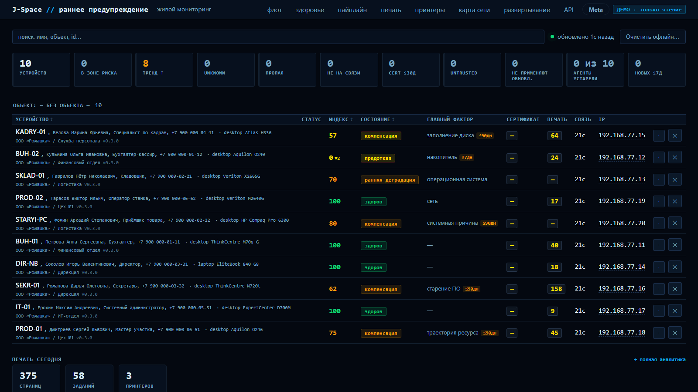
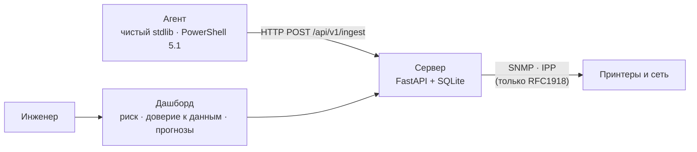
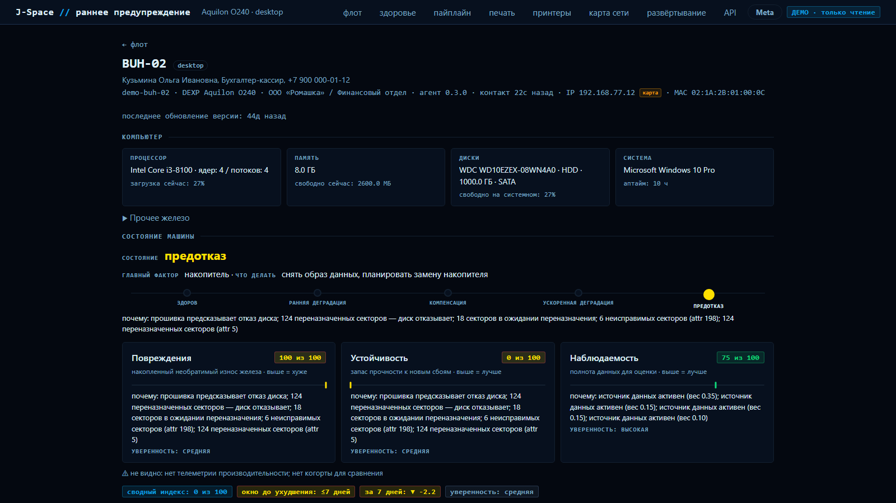
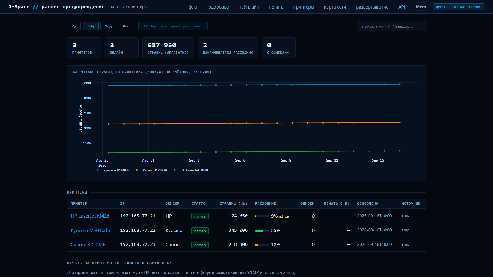
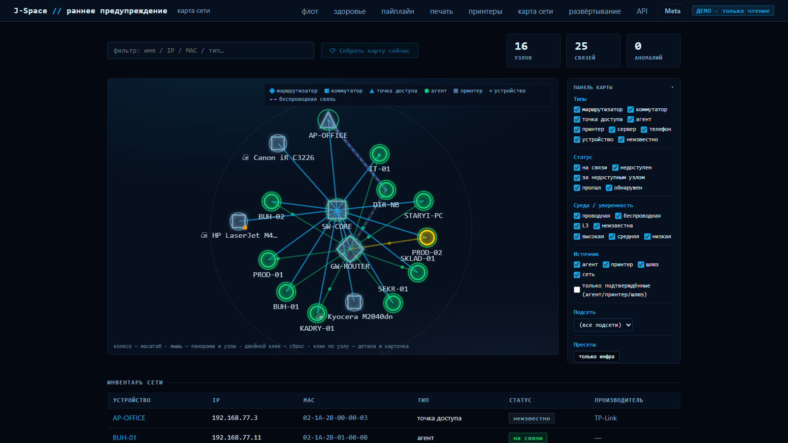
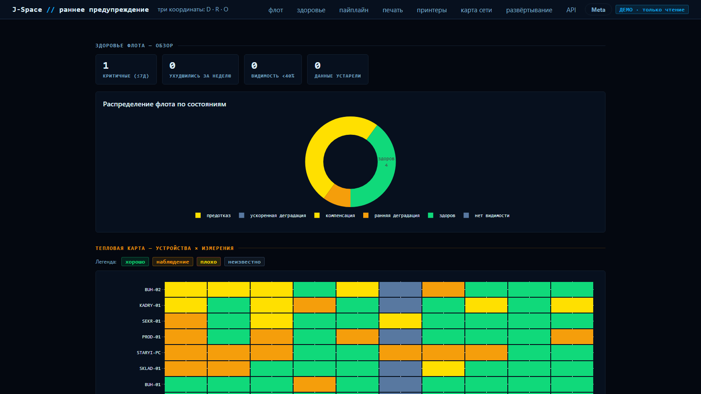

# SRP — раннее предупреждение отказов парка Windows-ПК

[](LICENSE)
[](https://www.python.org/)
[](https://j-space.ru)

**SRP — это self-hosted система раннего предупреждения отказов парка Windows-компьютеров.**
Она замечает деградацию машины **до** отказа: умирающий диск, деградирующую память или
зависший принтер видно раньше, чем это заметит пользователь. Тонкий агент без
единой сторонней зависимости собирает телеметрию (SMART, журналы событий, BSOD,
производительность, сеть, печать), сервер на FastAPI + SQLite копит историю и считает
объяснимые оценки здоровья, а живой дашборд показывает весь парк: компьютеры,
принтеры, карту сети и учёт печати.

[](https://j-space.ru)

> **Это публичный срез.** Репозиторий — публикация одним коммитом кода из приватного
> репо с историей 800+ коммитов; история разработки здесь не сохранена намеренно.
> Лицензия — [MIT](LICENSE): пользуйтесь, меняйте и распространяйте свободно,
> в том числе коммерчески.

## Как это работает

**Тонкий агент / толстый сервер.** Агент ничего не решает — он собирает телеметрию
(SMART, журналы событий, производительность, сеть, печать, сертификаты) и шлёт её
серверу; вся аналитика — на сервере.


```mermaid
flowchart LR
    A["Агент<br/>чистый stdlib · PowerShell 5.1"] -- "HTTP POST /api/v1/ingest" --> S["Сервер<br/>FastAPI + SQLite"]
    S -- "SNMP · IPP<br/>(только RFC1918)" --> N["Принтеры и сеть"]
    E["Инженер"] --> W["Дашборд<br/>риск · доверие к данным · прогнозы"]
    W --> S
```

| Слой | Технологии | Что делает |
|---|---|---|
| **Агент** | Windows, Python 3.9+, только стандартная библиотека — ноль pip-пакетов на рабочих машинах | Собирает телеметрию через CIM/PowerShell 5.1 (языконезависимо), отправляет конвертом раз в 5–15 минут |
| **Сервер** | FastAPI + SQLite, self-hosted, разворачивается одной командой | Валидирует, копит историю, считает риск и доверие к источникам |
| **Дашборд** | Серверный рендер (Jinja2), без сборки JS | Три координаты здоровья вместо одного числа, байесовский риск по классам отказа с объяснением каждого фактора, прогноз заполнения диска и расходников по SMART/тонеру, карта сети по SNMP/LLDP |

## Чем это отличается от обычного мониторинга

Классический мониторинг отвечает на вопрос «что сломано сейчас» и срабатывает по
порогам. SRP отвечает на другой вопрос: «что сломается следующим и когда».

| Вопрос | Классический мониторинг | SRP |
|---|---|---|
| На что отвечает | Что сломано прямо сейчас | Что сломается следующим и когда |
| Как срабатывает | Порог: диск на 90 % — авария | Тренд и срок до выхода за границу |
| Оценка машины | Одно число или набор графиков | Три независимые координаты: повреждения, устойчивость, наблюдаемость |
| Если данные врут | Считает их как есть | Источник теряет доверие и не участвует в выводах |
| Что ставится на ПК | Агент с зависимостями или опрос извне | Агент на чистой стандартной библиотеке, ноль pip-пакетов |

## Вопросы и ответы

### Что нужно, чтобы попробовать?

Python 3.9 или новее на машине, где будет сервер, и права администратора на
компьютерах, куда ставится агент. Сервер разворачивается из архива одной командой,
агент — установщиком, который спрашивает только адрес сервера. Ничего облачного не
требуется. Бесплатная версия принимает до трёх компьютеров.

### Уходит ли собранная телеметрия наружу?

Нет. Сервер разворачивается у вас, и данные никуда не отправляются. Серийные номера
дисков агент хеширует ещё до отправки — наружу уходит только хеш. Из сетевых адресов
передаются исключительно частные диапазоны локальной сети. Приватные ключи
сертификатов не собираются в принципе, только метаданные срока действия.

### Работает ли это на русской Windows?

Да, и это проверено на живых машинах. Агент читает счётчики через CIM и разбирает
только числа и английские имена перечислений — локализованный текст в расчёты не
попадает. Установщик тоже не зависит от языка системы: права назначаются по
идентификаторам, а не по именам групп.

### Что именно предсказывается?

Ресурс SSD и заполнение диска — по SMART и истории записи; дата исчерпания тонера —
по счётчикам SNMP. Для показателей без физической границы отказа (например,
троттлинг CPU) показывается только направление тренда: выдумывать срок там, где его
нет, система не станет.

## Скриншоты

Кадры сняты с демо-парка — десять вымышленных машин с настоящей историей телеметрии.
Живое демо и статичная копия: [j-space.ru](https://j-space.ru).

| | |
|---|---|
| [](docs/img/device-dying-disk.png) | [](docs/img/printers.png) |
| **Машина в предотказе.** 124 переназначенных сектора, 18 в ожидании, прошивка сама предсказывает отказ диска — с объяснением каждого фактора словами. | **Принтеры.** Уровни расходников по SNMP и прогноз даты, когда кончится тонер. |
| [](docs/img/netmap.png) | [](docs/img/health.png) |
| **Карта сети.** Роутер, коммутатор, точка доступа, машины и принтеры; беспроводные связи отличаются от проводных. | **Здоровье парка.** Распределение по состояниям и тепловая карта «машины × измерения». |

## Быстрый старт

Нужен Python 3.9+.

Если сервер скачан архивом `srp-server-free.zip` из раздела Releases — распакуйте
и запустите `install-server.bat`: он создаст `.venv`, поставит зависимости и
скажет, чем запускать. Ручной путь — ниже.

```powershell
# сервер
python -m venv .venv
.\.venv\Scripts\Activate.ps1
pip install -r requirements.txt
python -m server.main
# дашборд: http://<IP-сервера>:8000/
```

```powershell
# агент — на любой Windows-машине парка (или проверка на текущей)
python -m client.agent --server http://<IP-сервера>:8000 --once   # разовый проход
python -m client.agent                                            # постоянная работа
```

Для боевого раската — самодостаточный `setup.exe` со страницы **Releases** этого
репозитория (агент собран PyInstaller'ом, сам код агента остаётся чистым stdlib):

```bat
setup.exe --server http://<IP-сервера>:8000
```

Быстрая проверка всей цепочки без сети: `python smoke.py`.

## Обнаружение сети

Пассивное обнаружение (`netdisco.passive_enabled`) работает из коробки — сервер
собирает ARP/SNMP/LLDP-данные, которые агенты и так видят в своей подсети.

**Активное сканирование (`active_scan`) в этой сборке выключено.** Активный скан
пробует диапазоны IP той сети, где установлен сервер, — включать его по умолчанию
для незнакомой сети было бы неправильно: письменное разрешение владельца на активный
скан покрывает только его собственную локальную сеть, а не сеть человека, который
поставит SRP себе. Это тот же принцип, что и с автообновлением и мульти-организациями —
то, что требует ответственности за чужую инфраструктуру, не включено по умолчанию.

Включается сознательно, одной строкой: `netdisco.active_scan: true` и
`printers.active_scan: true` в `server/config.json`, затем перезапуск сервера — только
в своей собственной сети.

## Если у вас уже стоит Zabbix

SRP его не заменяет. Zabbix отвечает на вопрос «что сломано сейчас»; SRP считает то,
чего у Zabbix нет, — прогноз отказа — и отдаёт его туда обычными значениями элементов
данных. Дальше работают привычные триггеры, действия и эскалации.

Принцип: **в Zabbix уходит вывод, а не данные.** Всё, что помогает понять «почему»,
остаётся в SRP — там и смотрят. Наружу уезжает ровно четыре значения на компьютер:

| Ключ | Значение |
|---|---|
| `srp.state` | состояние: `h0` норма … `h4` предотказ, либо `unknown` |
| `srp.risk` | 0…100, больше — хуже |
| `srp.days_left` | через сколько суток ожидается ухудшение |
| `srp.reason` | главный фактор одной фразой, без идентификаторов |

Плюс один ключ на сам сервер SRP — `srp.last_run`, время последнего расчёта, чтобы
Zabbix видел, что SRP жив. Все элементы — типа «Zabbix trapper», готовые шаблоны
лежат в `docs/zabbix/srp_template.yaml`.

Включается одной настройкой — адресом Zabbix в `server/config.json`:

```json
"zabbix": { "server": "10.0.0.5" }
```

Непустой адрес и означает «включено»; перезапускать сервер не нужно. Проверить
настройку до включения:

```
python -m server.zabbix.check --server 10.0.0.5   # чек-лист по пунктам
python -m server.zabbix.check --list-hosts        # CSV имён узлов под массовый импорт
python -m server.zabbix.check --check-hosts       # какие узлы Zabbix ещё не знает
```

Недоступный Zabbix на работу SRP не влияет: у отправки жёсткие таймауты, ошибка
гасится в фоновом цикле и не доходит ни до приёма телеметрии, ни до скоринга.
Наружу не уходят ни серийники, ни адреса, ни имена пользователей, ни сырая
телеметрия. Траппер не шифруется, поэтому при не-локальном адресе SRP предупреждает
об этом в журнале.

## Чего нет в этом срезе

Публичный репозиторий — срез рабочего дерева, из которого убрана механика
развёртывания в конкретной сети автора: установщик агента с настройкой ACL,
пакеты автообновления парка и справочник организаций. Это не «урезанная
версия»: ограничений по числу машин нет, все возможности продукта на месте,
и никакой платной редакции не существует.

- **Автообновление агентов** — сервер отдаёт заглушку «пакета нет»; обновлять
  агентов можно тем же установщиком вручную.
- **Справочник организаций** — расшифровка кодов организаций и подразделений
  в человеческие названия; коды работают, названия остаются на вашей стороне.

## Поддержать проект

SRP не продаётся: ни подписок, ни платных функций, ни версии «для взрослых».
Если инструмент экономит вам вечер — поддержите разработку добровольно:

- Boosty: <https://boosty.to/personalbot/donate?qr=true>
- Картой или через СБП (CloudTips): <https://pay.cloudtips.ru/p/00d77c6a>
- Бесплатно и ценнее денег: звезда на GitHub, issue с найденной ошибкой,
  рассказ коллеге, который отвечает за парк офисных машин.

## Лицензия

[MIT](LICENSE) — используйте, изменяйте и распространяйте свободно, в том числе
в коммерческих проектах; единственное требование — сохранить текст лицензии
и указание авторства. Проект не продаётся и развивается на добровольные взносы.

---

*SRP разрабатывается для реальных парков офисных ПК на локализованной (русской)
Windows; каждое архитектурное решение проверено на живых машинах, а не в теории.*
